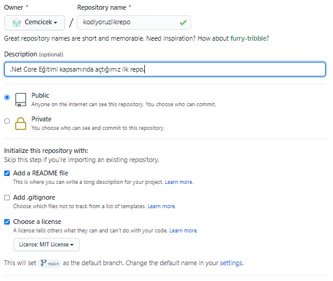

 
# Kodluyoruz ilk Repo
Bu repo [Kodluyoruz](https://www.kodluyoruz.org/) .Net Core Eğitiminde oluşturduğumuz ilk repo. İçerisinde bir adet Readme dosyası, bir adet index.html barındırıyor.

## Installation

Öncelikle projeyi clonelayın.(Buraya sizin reponuzdan aldığınız link gelecek)
<pre> git clone https://github.com/Cemcicek/kodluyoruzilkrepo</pre>
## Usage
Projeyi cloneladıktan sonra Visual Studio Code programında açınız.
Linux için:
<pre> cd kodluyoruzilkrepo
 code .</pre>
## Contributing
Pull requestler kabul edilir. Büyük değişiklikler için, lütfen önce neyi değiştirmek istediğinizi tartışmak için bir konu açınız.
## License 

[Mit](https://choosealicense.com/licenses/mit/)

